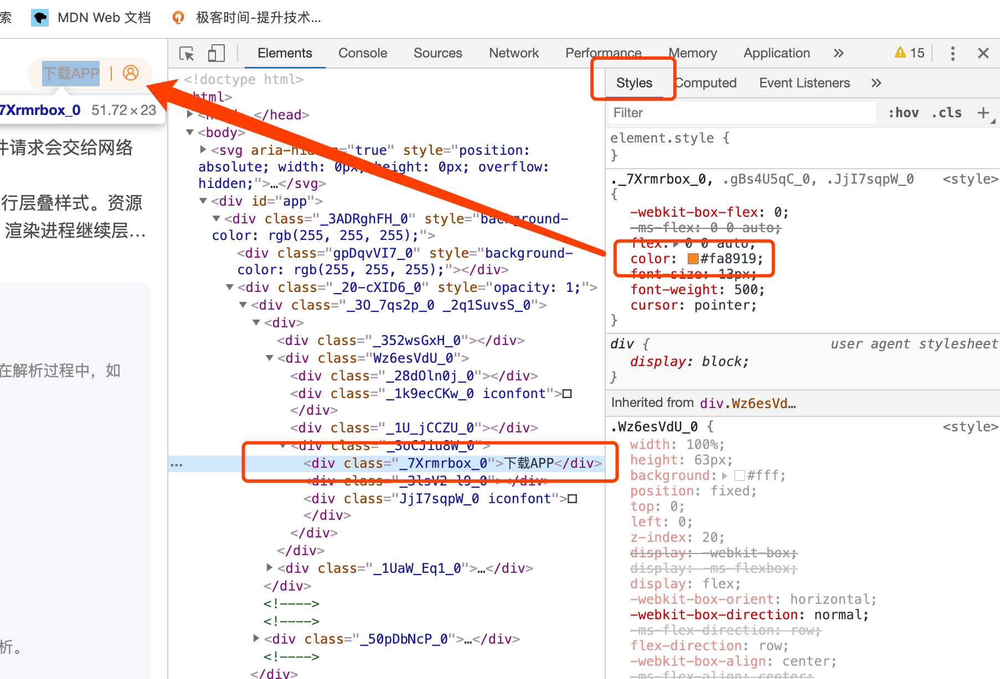
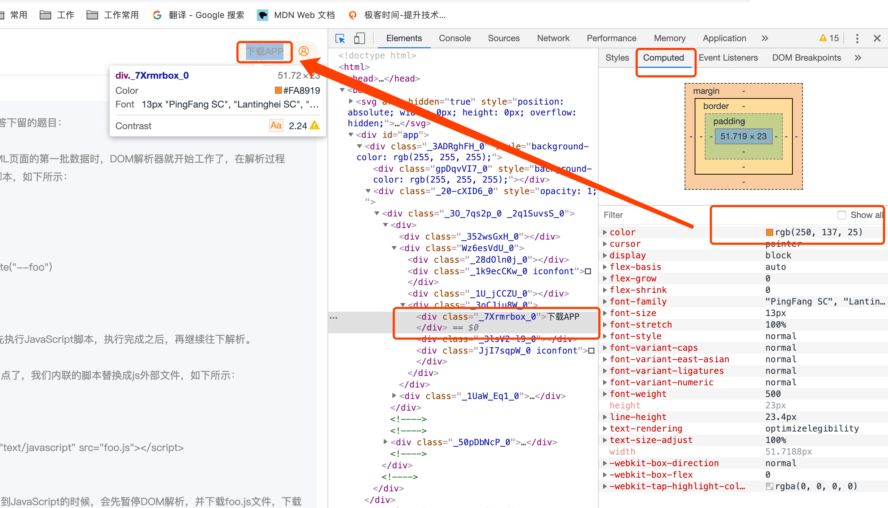
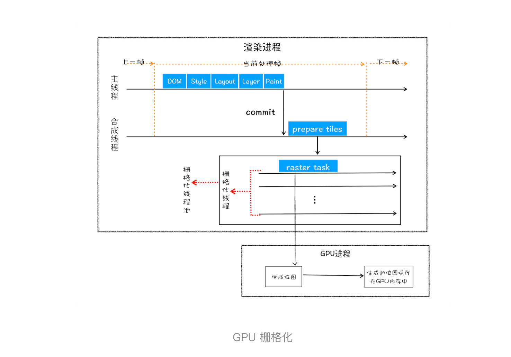
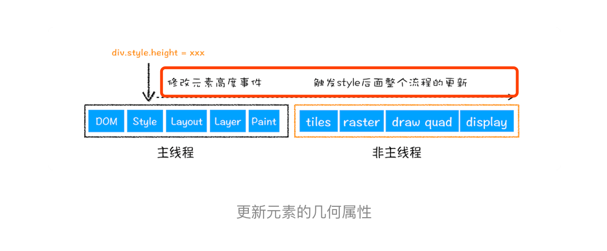

# 大部分 `web` 都是跑在浏览器环境中的
也有小部分前端，是跑在其他环境中的。很久以前一直想要了解浏览器是什么东西，看过很多文章，时效性都不行，好的文章我的英语把我拒之千里。所以我要好好学习英语。明天开始

## 浏览器是如何渲染网页的？
关于这个问题我想了很久，看了网上的很多文章，到如今我才有一个比较清晰的概念。如果你也想了解，推荐你看一系列文章 [浏览器工作原理与实践](https://time.geekbang.org/column/article/118205) ，目前我就基于这个写自己的理解。

网页三剑客（`html css javascript`)我就不多说了。如果把浏览器渲染比作一条流水线的话，前三步不用多说基本上大家都知道
> 1. `DOM` 生成 （这个细说能说很多，`AST` ，数据结构....)

> 2. 样式计算 

首先把 `css` 理解成浏览器能够理解的结构 `styleSheets`。转换样式表中的属性，使其标准化，这里可以涉及到性能优化，平时写代码的时候尽量标准化，可以加快浏览器渲染。举个例子：`vw`,`color:blue` 都会转化为渲染引擎容易理解的 `px`,`color:rgb(0,0,255)`。所以是不是我们可以在标准化这里注意代码书写，提高渲染速度呢？？

最后就是计算每一个 `DOM` 树中每一个节点的具体样式了。

> 3. 布局

完成之后并不是直接渲染到页面，并不是，只是把这些信息保存在布局树中，接下来是进行分层

> 4. 分层，你没有听错？

因为在页面中有很多复杂的效果，3D转换，页面滚动，z-index等等，提高了页面的层级，为了更加方便的实现这些效果，渲染引擎还需要为特定的节点生成专用图层，并生成一颗对应的图层树（如果你用过ps，就很好理解图层，分层了，拥有层叠上下文，被剪裁一般都会分层）

> 5. 图层绘制

就是把前面所生成的东西，画在网页上；每一个画一个 `DOM` 节点可以看成是执行一个绘制指令，一切准备就绪就可以把绘制指令交给渲染进程去渲染了

> 6. 栅格化操作
绘制列表只是用来记录绘制顺序和绘制指令的列表，而实际上绘制操作是由渲染引擎中的合成线程来完成的。

为啥会有栅格化？
 因为在有些情况下图层可以很大，我们要使用滚动条滚动好久之后才滚动到底部，而我们可视区只有固定的一部分；所以合成线程会按照视口附近的图块来优先生成位图（生成位图的操作就是栅格化来执行的），通常栅格化过程都会使用 `GPU` 来加速生成

> 7. 合成和显示
所有的图块都被栅格化，合成线程就会生成一个绘制图块的指令把他交给浏览器进程，浏览器把内容绘制到内存中，然后内存显示在屏幕上。就完成了整个渲染

## 题外话： 关于重排和重绘

关于重排和重绘，网上文章很多，你能理解记住看懂的就是好文章。我写的我看懂了，你懂不懂我不知道

我们在发送请求的时候带上了多余的用户信息，比如一些不必要的 `cookie` ，服务器接收到这些信息可能需要对每一项都做处理，这样加大了服务器的处理时间