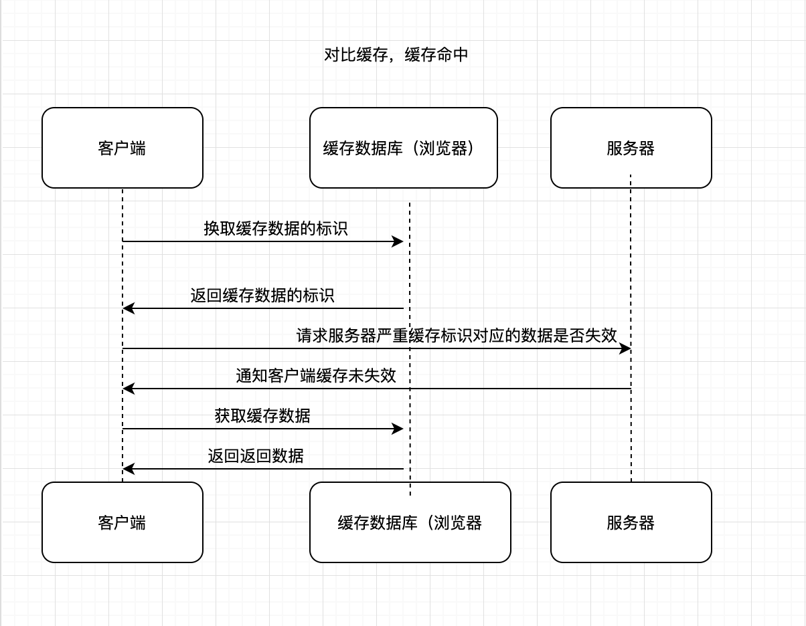
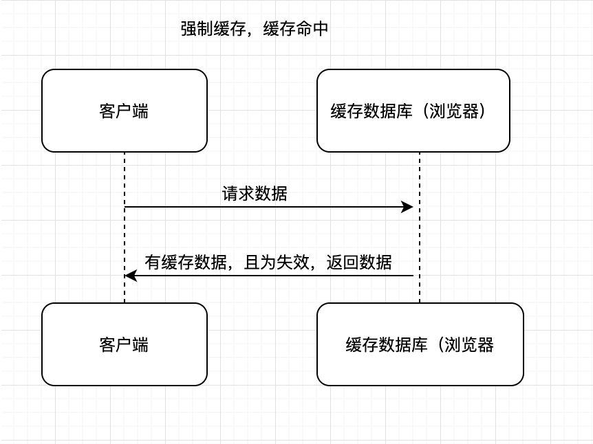
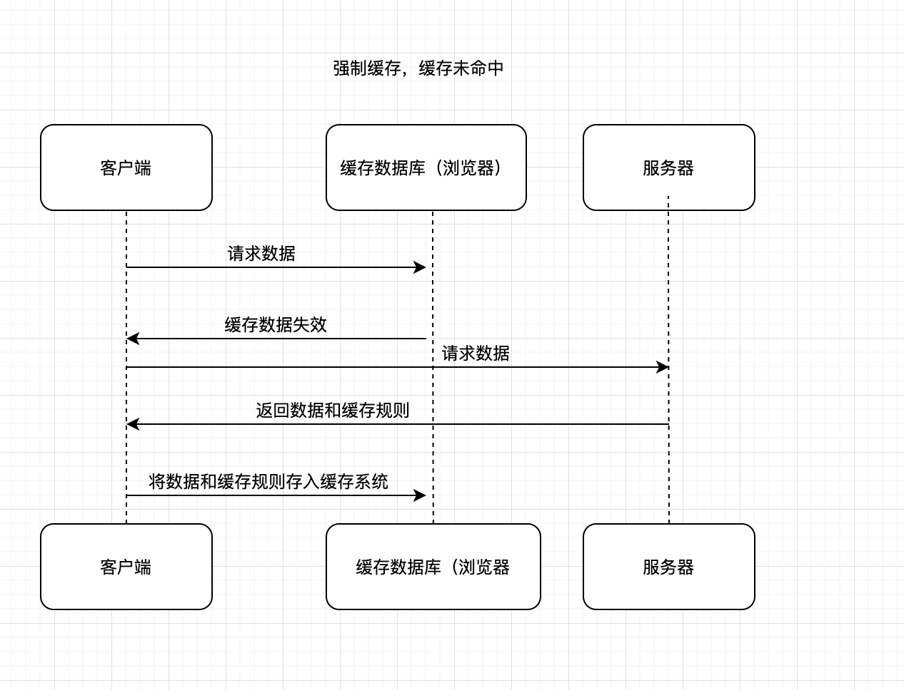
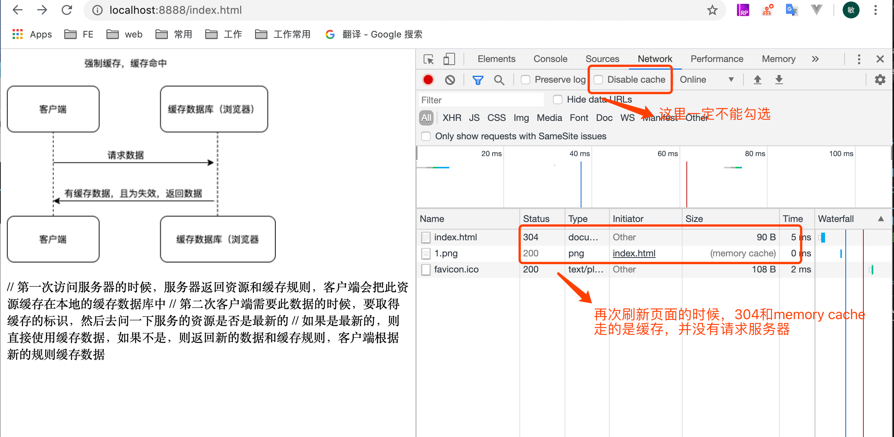

## `HTTP`

协议是一个双向协议，两点之间传输数据的约定和规范。超文本：超越了普通文本的文本，包括文字，图片，音频视频，链接等等

浏览器本质上是一个 `HTTP` 协议中的请求方，使用 `HTTP` 协议获取网络上的各种资源，`HTML` 排版引擎用来展示页面，`javaScript` 引擎用来实现动态化效果，等等

## 专有名词解释

`CDN` : 通常浏览器不会直接链接到服务器，中间会经过“重重关卡”，其实有一个重要的角色就是 `CDN` （内容分发网络），替代源站响应客户端的请求

`TCP` :传输层

`IP` : 网际层，主要目的是解决寻址和路由的问题，以及两点间传送数据包

`IP` 地址： 定位互联网上的每一台计算机，比如电话系统里面，电话号码就相当于 `IP` 地址

`TCP` 协议：基于 `IP` 协议提供可靠的，字节流形式的通信，是 `HTTP` 协议得以实现的基础

`DNS` 域名系统：用有意义的名字作为 `IP` 地址的等价替换，把域名做一个转化，映射到他的真实 `IP` 叫做域名解析。比如给电话号码起一个备注，根据备注找到电话号码就叫域名解析

`URR/URL` 统一的资源标识符/统一定位符；通过前面的可以找到互联网上的主机，但是主机上面有很多东西，需要进一步定位到具体的，就用到了他。比如电话打通了，开始说具体事情了。

`SSL/TLS` :（对称加密，非对称加密....) 他是一个负责加密通信的安全协议，(比如：保证通话内容没有被窃听）在 `TCP/IP` 协议之上

代理： 是 `HTTP` 协议中请求方和应答方中间的一个环节，可以转发客户端的请求，可以转发服务器的请求。`CDN` 实际上就是一种代理

网关：接受客户端发送过来的数据，然后转发给非 `HTTP` 服务器，然后再有自己返回给客户端。因为有些服务器不是 `HTTP` 服务器，也是可以提高通信的安全性

负载均衡：把访问请求均匀分散到多台机器上，实现访问集群化

内容缓存： 暂存上下行的数据，减轻后端的压力

安全防护：隐藏 `IP` ，防御网络攻击，保护被代理的机器

数据处理： 提供压缩，加密等额外的功能

爬虫：各地搜索引擎放出来的，抓取网页存入庞大的数据库，再建立关键字索引，可以我们就可以快速搜索到我们想要的东西了。缺点：过度消耗网络资源，占用宽带和服务器，影响网站对真实数据的分析，敏感信息的泄漏。

## TCP/IP 协议的工作方式

极客时间里面有一个老师讲的蛮好的，我就直接那图过来了


同源策略主要表现在三个方面：`DOM`，`web` 数据，网络
`DOM` ：不同源的 `javaScript` 脚本对当前 `DOM` 对象的读写操作

`HTTP`：实体首部是以 `Content` 开头的，是用来描述请求体的信息，比如请求体的类型 `Content-Type`，比如描述请求体大小的 `Content-Length` ....

中央服务器分发是内容复制到附近的服务器

## node 创建一个 http 服务器

请求的一方叫客户端，响应的一方叫服务器端

通过请求和响应达成通信

`http` 服务器是继承 `tcp` 服务器，`http` 协议是应用层协议，是基于 `TCP` 的。 `TCP` 属于传输层协议。

`http` 他对请求和响应进行了包装 （报文体），`req` 和 `res` 都是从 `socket` 来的，先监听 `socket` 的 `data` 事件，然后
等事件发生的时候，进行解析出请求头对象，在创建请求对象，在根据请求对象创建响应对象

```
let http = require("http")
let url = require('url') // 对url进行解析
// req 流对象，是可读流
// res 是一个可写流 write
// 发消息的时候不等于和客户端连接，连接是一个长连接

 let server = http.createServer((req,res)=>{

}).listen(8080,()=>{
   console.log('server starts at http://localhost:8080');
})

// 服务器监听客户端的请求，当有请求到来的时候执行回调

// req 代表客户端的连接，server 服务器把客户端的请求信息进行解析，然后放在 req 上面
// res 代表响应，如果希望向客户端响应消息，需要通过 res
server.on('request', (req, res) => {
  console.log(req.method); // 获取请求方法名
  console.log(req.url); // 获取请求路径
  console.log(req.headers); // 获取请求头对象
  let result = []

  req.on('data', data => { // 请求体
    result.push(data)
  })

  req.on('end', () => {
    let r = Buffer.concat(result)
    res.end(r) // 解析完之后返回给客户端
  })
})


server.on('close', (req, res) => {
  console.log('服务器已经关闭');
})

server.listen(8080, () => {
  console.log('server starts at http://localhost:8080');
})
```

## http 长什么样子

报文首部 + 空行 + 内容实体（报文主体）
报文首部 = 请求行+请求头（通用头，请求头，响应头，实体头

如果你不想用 `node` 去查看请求与响应的一些数据，也不想打开浏览器查看，这里有一个简单的方法，输入几行命令进行查看，其他参数，自行百度（我的是 `mac`)

`curl -I http://www.baidu.com` 就能看到服务器响应的首部信息的

`curl -v http:/www.baidu.com` 能够看到请求和响应的详细信息

- 请求参数 req

  > GET / HTTP/1.1
  > Host: localhost:8080
  > User-Agent: curl/7.54.0
  > Accept: \* > \*/

  '内容实体'

## 借用 `node` 查看 `HTTP` 的请求与响应

`HTTP` 是一种不保存状态的协议

以 `node` 为例，写一个简单的服务器

请求的时候分为：请求行/请求头/请求体，头分为通用头，请求头，响应头，实体头

模拟客户端发送请求

```
let http = require('http')
let url = require('url')

// 请求相关的信息
const options = {
  host: 'localhost',
  port: 8080,
  method: 'POST',
  header: {
    'Content-Type': 'application/x-www-form'
  }
}

// 创建一个请求并，此时没有真正发出，只有等 end 方法之后，才会发送请求。req 也是一个流对象，他是一个可写流
const client = http.request(options)

// write 是向请求体里写数据
client.write('username=sunseeker')

// 是结束写入请求体，只有在调用end的时候才真正向服务器发送请求
client.end()

```

简单的服务器像客户端写入响应信息

```
let server = http.createServer((req, res) => {
  res.statusCode = 200 //设置响应码
  res.sendDate = false // Date 响应头默认会设置，如果真的不想要，可以设置 false
  res.setHeader('Content-Type', 'text/html;charset=utf8') //设置响应头
  console.log(res.getHeader('Content-Type')); // 获取响应头
  res.removeHeader("Content-Type") // 移除响应头
  res.write('hello world')
  res.end() //在可写流关闭之后，不能再次写入了
})
server.listen(8080, () => {
  console.log('server starts at http://localhost:8080');
})
```

复杂的模拟服务器接受到的请求（这里是一个上传文件的例子，客户端向服务器发起请求的时候，会通过 accept-encoding 告诉服务器我支持的压缩格式）

```
http.createServer(requrst).listen(8888)
async function requrst(req, res) {
   // req: 请求的的字段，后面服务器用于有各种数据解析

  let { pathname } = url.parse(req.url) // msg.txt
  let filepath = path.join(__dirname, pathname)

  try {
    let statObj = await stat(filepath)
    res.setHeader('Content-Type', mime.getType(pathname))  // 可以根据不同的文件内容类型返回不同的Content-Type

    let acceptEncoding = req.headers['accept-encoding'] // 为了兼容不同的浏览器。node把所有的请求头全部转成了小写

    if (acceptEncoding) { // 内容协商 读取文件内容渲染到浏览器上面

      if (acceptEncoding.match(/\bgzip\b/)) {  // 告诉服务器，客户端用什么方法压缩了
        res.setHeader("Content-Encoding", 'gzip')
        fs.createReadStream(filepath).pipe(zlib.createGzip()).pipe(res)
      } else if (acceptEncoding.match(/\bdeflate\b/)) {
        res.setHeader("Content-Encoding", 'deflate')
        fs.createReadStream(filepath).pipe(zlib.createDeflate().pipe(res))
      } else {
        fs.createReadStream(filepath).pipe(res)

      }
    } else {
      fs.createReadStream(filepath).pipe(res)
    }
  } catch (err) {
    console.log(err);
    res.statusCode = 404
    res.end()
  }
}

```

顺便简单介绍一个我所理解的三次握手和四次挥手，大概意思，不一定准备，简单粗糙的理解。

三次握手发生在 `TCP` 数据传递的时候，在客户端和服务器建立链接之后。客户端向服务器发送一个信息，说我们建立链接发送数据吧？=> 服务器收到信息以后，=>回复客户端说好的呀！ 我准备好了。客户端看到请求之后=>回服务器，我也准备好了，服务端看到客户端回了自己，知道自己发出去的消息客户端是可以收到的。这里就完成了三次握手。

四次挥手，客户端想要和服务器断开连接。客户端和服务器说，我要和你断开连接了=> 服务器看了消息说，好的，我还有一些数据没有传输完，我还有一些事情没有处理完。=> 客户端等到服务器传输没有传完或者处理完的事情，过了一会服务器又和客户端发消息说 => 我这边处理完毕了。客户端看到了，=> 断卡连接

## 流

当我们往可写流写数据的时候，不是会立刻写入文件的，而是会先写入缓存区，然后等缓存区写满了之后再次真正的写入文件里

加密就是一种流的转化

普通流里面放的是普通流，对象流里面放的是对象流

数据在不同的层传递，名字不一样
物理层：帧 `frame`
网络层：数据包 `package`
传输层：段 `segment`

`ip` 头服务类型普通< 音频 < 视频 < 网络 < 路由。在数据传输的时候有这个优先级
数据在传输的过程中切割了多少片，偏移量是多少，都在 `ip` 数据包的请求头里面

大文件分段传输的时候，这里用的上核心问题还是带宽不够

## 缓存与状态码

第一次访问服务器的时候，服务器返回资源和缓存规则，客户端会把此资源缓存在本地的缓存数据库中

第二次客户端需要此数据的时候，要取得缓存的标识，然后去问一下服务的资源是否是最新的

如果是最新的，返回一个状态码，则直接使用缓存数据，如果不是，则返回新的数据和缓存规则，客户端根据新的规则缓存数据






```
// 第一次访问服务器的时候，服务器返回资源和缓存规则，客户端会把此资源缓存在本地的缓存数据库中
// 第二次客户端需要此数据的时候，要取得缓存的标识，然后去问一下服务的资源是否是最新的
// 如果是最新的，则直接使用缓存数据，如果不是，则返回新的数据和缓存规则，客户端根据新的规则缓存数据

const http = require("http")
const url = require("url")
const path = require("path")
const fs = require('fs')
const mime = require('mime') // 设置返回文件的类型
const crypto = require('crypto');


http.createServer((req, res) => {
  let {
    pathname
  } = url.parse(req.url, true)

  // /Users/sunseekers/Desktop/code/node/http/cache/index.html
  let filepath = path.join(__dirname, pathname)
  fs.stat(filepath, (err, stat) => {
    if (err) {
      // console.log(err);
      return sendError(req, res)
    } else {
      // let ifModified = req.headers['if-modified-since']
      // let LastModified = stat.ctime.toGMTString()
      // if (ifModified == LastModified) {
      //   res.writeHead(304) // 服务器返回304，表示资源未改过，可以直接用原来的
      //   res.end('')
      // } else {
      //   return sendLastModified(req, res, filepath, stat)
      // }

      // 第一种（ETag)，生成一段hash值

      let ifNoneMatch = req.headers['if-none-match']
      let out = fs.createReadStream(filepath)
      let md5 = crypto.createHash('md5')
      out.on('data', data => {
        md5.update(data)
      })
      out.on('end', data => {
        //1.相同的输入相同的输出 2 不同的输入不同的输入 3 不能从输出反推出输入

        let etag = md5.digest('hex')
        return sendETag(req, res, filepath, etag);

        // if (ifNoneMatch == etag) {
        //   res.writeHead(304);
        //   res.end('');
        // } else {
        //   return sendETag(req, res, filepath, etag);
        // }
      })
    }
  })
}).listen(8888, () => {
  console.log('server starts at http://localhost:8888/');
})

// 通过响应头发给客户端，客户端会把此时间保存起来，下次在获取资源的时候会把这个时间在发给服务器

// 第一种（Last-Modified）设置缓存的规则：根据文件最后的修改时间来定；缺点，修改时间变了，但是内容没有变/服务器时间精确问题/东西存储在cdn服务器上
function sendLastModified(req, res, filepath, stat) {
  res.setHeader('Last-Modified', stat.ctime.toGMTString())
  res.setHeader("Content-Type", mime.getType(filepath))
  fs.createReadStream(filepath).pipe(res)
}

function sendError(req, res) {
  res.end("Not found")
}

// 第一种（ETag)，生成一段hash值
function sendETag(req, res, filepath, etag) {
  res.setHeader('ETag', etag)

  // 强制缓存
  res.setHeader('Cache-Control', 'max-age=30');

  res.setHeader("Content-Type", mime.getType(filepath))
  fs.createReadStream(filepath).pipe(res)
}

/**
 * 强制缓存
 * 把资源缓存在客户端，如果客户端再次需要此资源的时候，先获取到缓存中的数据，看是否过期，如果过期了。再请求服务器
 * 如果没过期，则根本不需要向服务器确认，直接使用本地缓存即可
    res.setHeader('Cache-Control', 'max-age=30');
 *
 */
```


